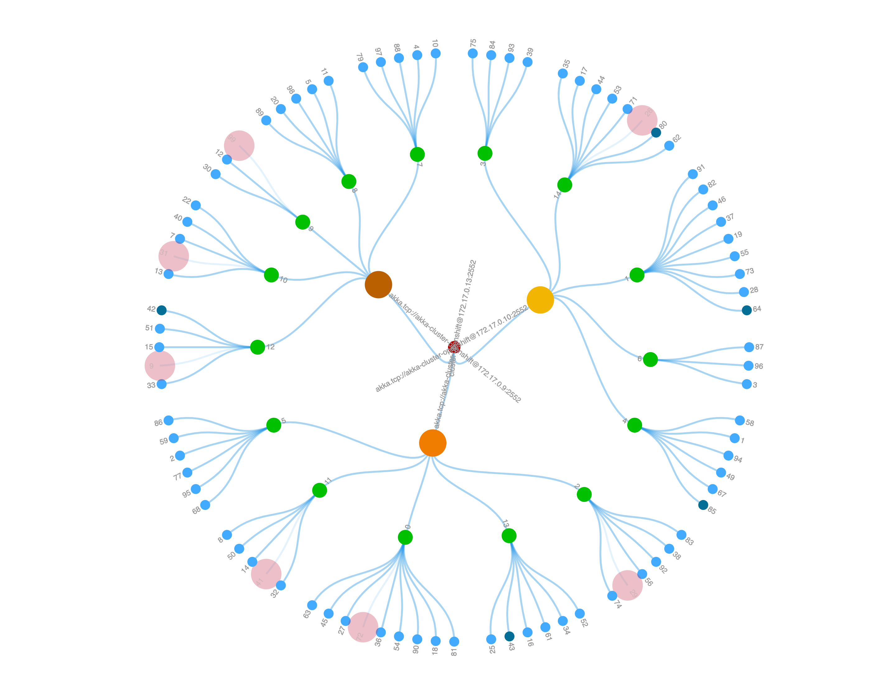

## Akka Java Cluster Kubernetes Example

### Introduction

This is a Java, Maven, Akka project that demonstrates how to setup an
[Akka Cluster](https://doc.akka.io/docs/akka/current/index-cluster.html)
with an example implementation of
[Cluster Sharding](https://doc.akka.io/docs/akka/current/cluster-sharding.html) running in a Kubernetes cluster.

This project is one in a series of projects that starts with a simple Akka Cluster project and progressively builds up to examples of event sourcing and command query responsibility segregation.

The project series is composed of the following projects:
* [akka-java-cluster](https://github.com/mckeeh3/akka-java-cluster)
* [akka-java-cluster-aware](https://github.com/mckeeh3/akka-java-cluster-aware)
* [akka-java-cluster-singleton](https://github.com/mckeeh3/akka-java-cluster-singleton)
* [akka-java-cluster-sharding](https://github.com/mckeeh3/akka-java-cluster-sharding)
* [akka-java-cluster-persistence](https://github.com/mckeeh3/akka-java-cluster-persistence)
* [akka-java-cluster-persistence-query](https://github.com/mckeeh3/akka-java-cluster-persistence-query)
* [akka-java-cluster-kubernetes](https://github.com/mckeeh3/akka-java-cluster-kubernetes) (this project)

Each project can be cloned, built, and runs independently of the other projects.

This project contains an example implementation of cluster sharding running in a Kubernetes cluster. The project also includes a live web client visualization of the cluster and the Akka actors running in the cluster JVMs.

Figure 1, Visualization of cluster sharding
 

Once this application is successfully deployed to a properly configured Kubernetes cluster you will be able to pull up a live view of the running system, as shown above in Figure 1.

The above visualization is rendered using the [D3Js](https://d3js.org/) library. The web page used to render the visualization is located in `src/main/resources/monitor.html`.

The monitor webpage is accessed via the HTTP server that is running in the `HttpServerActor` class. The HTTP server is started in this actor so in addition to handling HTTP requests this actor also handles incoming actor messages.

The monitor web page uses a web socket to communicate with the HTTP server. The primary action is that every few seconds, the web page sends a request for the current status of the running cluster. The HTTP server actor responds with a JSON tree that contains the current cluster state.

This tree starts with a single root element that represents the cluster. The next tree elements up from the root represent Akka cluster nodes. These elements also represent actors that are started one per cluster node. An example of a single actor per cluster node is the `HttpServerActor`. One instance of this actor is started on each Akka cluster node.

In the visualization shown in Figure 1, the three large circles represent the Akka cluster nodes. These circles are shown using the colors brown, orange, and yellow. A yellow circle indicates which node is receiving HTTP requests from the browser. A brown circle is used to show where cluster singleton actors are currently located in the cluster. Orange circles show other cluster nodes.

Continuing up from the Akka node tree elements are shard actor elements. Shard actors are used in Akka Cluster Sharding to distribute entity actor instances across the cluster nodes. In the visualized tree the shard actors are shown as green circles. There are a fixed number of shard actors. The number of shard actors is defined in the `application.conf` file. In the visualization, you will see that the fixed number of shard actors will redistribute themselves across the cluster and the number of cluster nodes changes.

The tree leaf elements represent individual entity actors. The entity actors are shown as blue circles. When an entity actor instance is first started, the color used is a darker blue. When an entity actor instance is stopped the color fades to pink and then the circle disappears.

### Installation

There are several options for how we set up a running Kubernetes environment. You can install everything on your local development system, or you can use one fo the cloud-based offerings. In addition to setting up a Kubernetes environment, you will also need to install Docker on your local development system. Of course, you will also need to install Java 8 and Maven 3.6.x.

#### Install Java and Maven

"There are various ways to get free updates (including security), and (new and existing) paid support models available from various vendors to consider." - [Source Java is Still Free](https://medium.com/@javachampions/java-is-still-free-c02aef8c9e04).

You can find Java downloads at the followinf locations:

* [AdoptOpenJDK](https://adoptopenjdk.net/)
* [Amazon](https://aws.amazon.com/corretto/)
* [Azul](https://www.azul.com/products/zulu-enterprise/)
* [BellSoft](https://bell-sw.com/java.html)
* [IBM](https://www.ibm.com/marketplace/support-for-runtimes)
* [jClarity](https://www.jclarity.com/)
* [Red Hat](https://access.redhat.com/articles/1299013)
* [SAP](https://github.com/SAP/SapMachine)

The [ApaptOpenJDK](https://adoptopenjdk.net/) is recommended as this is the JDK that Lightbend engineerin teams build against.

Maven 3.6.x is available for download on the Apache Maven [download page](https://maven.apache.org/download.cgi).

#### Install Docker

This project includes two Maven plugins. One of the plugins creates a self-contained JAR file that contains all of the compiled project class files and all of the dependencies. The other plugin creates a Docker image that contains the JAR file and the necessary settings that are used to run the Java code.

Follow the link for the [Docker installation](https://hub.docker.com/search?q=&type=edition&offering=community) for your device.

#### Install Kubernetes MiniKube Locally

Instructions and download are available on the [Install MiniKube](https://kubernetes.io/docs/tasks/tools/install-minikube/) page.

#### Install OpenShift MiniShift

Instructions and download are availabel on the [Welcome to MiniShift](https://docs.okd.io/latest/minishift/index.html) page.

#### Using OpenShift Online

TODO

#### Uising IBM Cloud Kubernetes Service

TODO

### Build and Deploy the Demo Application

The following command builds the project, loads all of the code and dependencies into a single JAR file, and then creates a Docker image that is set up to run the JAR file in a Docker container.

When running Kubernetes on your laptop, the instructions for each specific set up define how Docker is used when Docker images are created.

~~~bash
mvn clean package docker:build
~~~

The Docker image is deployed to a Kubernetes environment using the following two steps.

First, a Role and RoleBinging are set up. The Role and RoleBinding give the pods access to the API server. More details are provided in the [Kubernetes API](https://doc.akka.io/docs/akka-management/current/bootstrap/kubernetes-api.html#kubernetes-api) documentation, which is part of [Akka Cluster Bootstrap](https://doc.akka.io/docs/akka-management/current/bootstrap/index.html#akka-cluster-bootstrap). The Role and RoleBinding only need to be created once.

~~~bash
kubectl apply -f kubernetes/akka-cluster-rolebindging.yml
~~~

Or, for example, deploy using MiniShift.

~~~bash
oc apply -f kubernetes/akka-cluster-rolebindging.yml
~~~

The second step is to deploy the Docker image.

~~~bash
oc apply -f kubernetes/akka-cluster-deployment.yml
~~~

Three Kubernetes pods are started once the Docker image is deployed using the deployment YAML file.

~~~bash
$ kubectl get pods
NAME                                 READY   STATUS    RESTARTS   AGE
akka-cluster-demo-56c6c46cb4-5zvpl   1/1     Running   16         22d
akka-cluster-demo-56c6c46cb4-khl6g   1/1     Running   6          14d
akka-cluster-demo-56c6c46cb4-thscr   1/1     Running   8          22d
~~~

After the Kubernetes pods are started the next step is to expose the visualization web page to an accessible network location.

~~~bash
expose deployment/akka-cluster-demo --type=NodePort --port 8080
~~~

The visualization web page should now be accessible. Use the following commands to obtain the web page port and the IP address.

~~~bash
export NODE_IP=$(kubectl ip)

export NODE_PORT=$(kubectl get services/akka-cluster-demo -o go-template='{{(index .spec.ports 0).nodePort}}')

echo http://$NODE_IP:$NODE_PORT
~~~

Use the above URL to access the visualization web page.

### Running the Cluster demo

Once the cluster is running, you can simulate the elasticity and resilience of the Akka cluster running in a Kubernetes environment. With Kubernetes, you can configure a cluster to auto scale the number of running pods based on CPU and memory utilization. With the cluster visualization, you can demonstrate what happens when the cluster is scaled up or down by manually scaling up or down the number of running pods.

~~~bash
kubectl scale --replicas=5 deployment/akka-cluster-demo
~~~

Use the `kubectl` or `oc` command to view the number of running pods.

~~~bash
$ kubectl get pods
NAME                                 READY   STATUS    RESTARTS   AGE
akka-cluster-demo-56c6c46cb4-5hk7p   1/1     Running   0          1m
akka-cluster-demo-56c6c46cb4-5zvpl   1/1     Running   16         22d
akka-cluster-demo-56c6c46cb4-khl6g   1/1     Running   6          14d
akka-cluster-demo-56c6c46cb4-lx9mv   1/1     Running   0          1m
akka-cluster-demo-56c6c46cb4-thscr   1/1     Running   8          22d
~~~

With auto-scaling, the number of running pods are adjusted as the CPU or memory loads change. Manually you can scale down the number of nodes to simulate this and then use the cluster visualization to view what is happening both at the Kubernetes level and the Akka level.

~~~bash
$ kubectl scale --replicas=1 deployment/akka-cluster-demo
deployment.extensions/akka-cluster-demo scaled

$ kubectl get pods
NAME                                 READY     STATUS        RESTARTS   AGE
akka-cluster-demo-56c6c46cb4-5hk7p   1/1       Terminating   0          8m
akka-cluster-demo-56c6c46cb4-5zvpl   1/1       Terminating   16         22d
akka-cluster-demo-56c6c46cb4-khl6g   1/1       Running       6          14d
akka-cluster-demo-56c6c46cb4-lx9mv   1/1       Terminating   0          8m
akka-cluster-demo-56c6c46cb4-thscr   1/1       Terminating   8          22d
~~~

Click one of the pod circles to simulate the loss of a pod. Clicking a pod will trigger the JVM to stop, which will trigger Kubernetes to restart the pod. Visually this is shown where the clicked pod and all of the associated actors disappear. Kubernetes reacts by restarting the pod. In the visualization, you will see a new pod appear after a brief period.

### The Visualization and Akka Cluster Aware Actors

The visualization of the cluster presents an interesting problem. In the visualization, actors are shown from across the cluster. However, browser requests from the visualization web page of course land on a single cluster node. So the challenge is how to show all of the activity from across the cluster from a single node? The solution is using cluster-aware actors. A cluster-aware actor knows, by design, that there are instances of itself on each node in the cluster. When one of the cluster-aware actors receives a message, this can trigger that actor to send messages to the other instances of itself. In the case of the visualization, when an `EntityActor` starts or stops, it sends a message to the `HttpServerActorntity`. These entity messages are used to add or remove the corresponding tree elements that are used to show entities in the visualization tree.

~~~java
private void notifyStart() {
    EntityMessage.Action start = new EntityMessage.Action(memberId, shardId, entityId, "start", true);
    httpServer.tell(start, self());
}

private void notifyStop() {
    EntityMessage.Action stop = new EntityMessage.Action(memberId, shardId, entityId, "stop", true);
    httpServer.tell(stop, self());
}
~~~

The `EntityActor` contains two methods, `notifyStart()` and `notifyStop()`. These methods are invoked when an instance of an entity actor instance is started or stopped. Note that this actor sends a message to the `HttpServerActor`.

~~~java
private void actionEntity(EntityMessage.Action action) {
    log().info("Entity {} <-- {}", action, sender());
    if (action.action.equals("start")) {
        tree.add(action.member, action.shardId, action.entityId);
    } else if (action.action.equals("stop")) {
        tree.remove(action.member, action.shardId, action.entityId);
    }
    if (action.forward) {
        forwardAction(action.asNoForward());
    }
}
~~~

When an `HttpServerActor` receives a start or stop message from an entity actor, it invokes the 'actionEntity(...)` method. Note that the tree object adds or removes the entity based on the information provided in the actor message. Then, if the message forward flag is true, the `forwardAction(...)` method is invoked.

~~~java
private void forwardAction(Object action) {
    cluster.state().getMembers().forEach(member -> {
        if (!cluster.selfMember().equals(member) && member.status().equals(MemberStatus.up())) {
            forwardAction(action, member);
        }
    });
}

private void forwardAction(Object action, Member member) {
    String httpServerPath = member.address().toString() + self().path().toStringWithoutAddress();
    ActorSelection httpServer = context().actorSelection(httpServerPath);
    log().debug("{} --> {}", action, httpServer);
    httpServer.tell(action, self());
}
~~~

There are two overloaded `forwardAction(...)` methods. The first method loops through all of the nodes in the cluster. In the loop, cluster members are filtered to select only node members that are in the `up` state and are not this node.

The second `forwardAction` method builds an actor selection, which is similar to actor references, using the passed member info and the path part of this actor's actor reference. Note that the forward flag in the forwarded message is set to false.

So the flow here is that as each `EntityActor` starts or stops it sends an action message to an `HttpServerActor`, which happens to be an instance of the `HttpServerActor` running on the same node as the `EntityActor`. The `HttpServerActor` is cluster aware, it has the necessary code that forwards the action messages on to the other `HttpServerActors` running on each node in the cluster.
